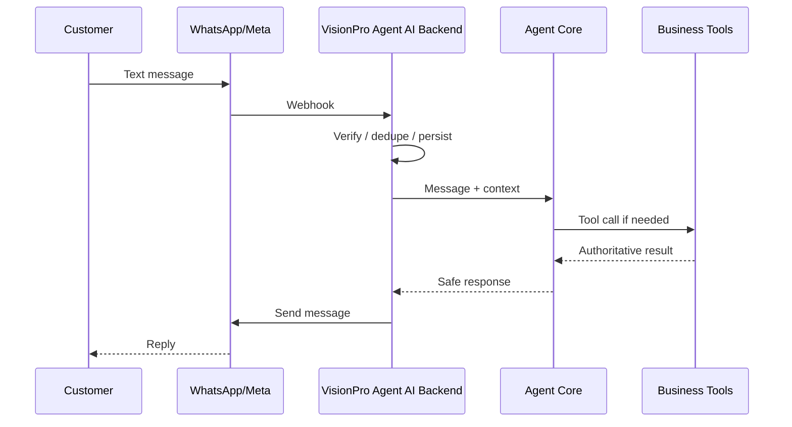
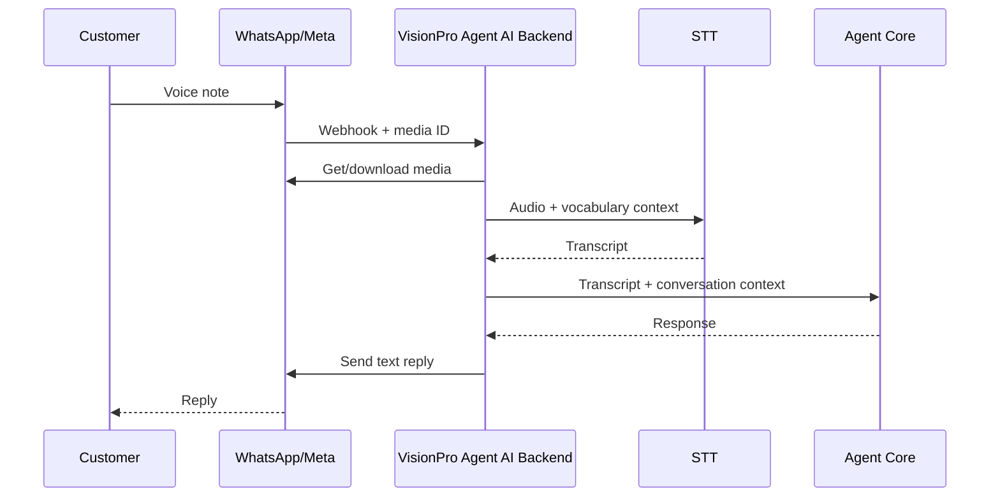

# Workflow Diagrams

## Text

```mermaid
sequenceDiagram
  participant C as Customer
  participant W as WhatsApp/Meta
  participant B as VisionPro Agent AI Backend
  participant A as Agent Core
  participant T as Business Tools
  C->>W: Text message
  W->>B: Webhook
  B->>B: Verify / dedupe / persist
  B->>A: Message + context
  A->>T: Tool call if needed
  T-->>A: Authoritative result
  A-->>B: Safe response
  B->>W: Send message
  W-->>C: Reply
```

## Voice note

```mermaid
sequenceDiagram
  participant C as Customer
  participant W as WhatsApp/Meta
  participant B as VisionPro Agent AI Backend
  participant S as STT
  participant A as Agent Core
  C->>W: Voice note
  W->>B: Webhook + media ID
  B->>W: Get/download media
  B->>S: Audio + vocabulary context
  S-->>B: Transcript
  B->>A: Transcript + conversation context
  A-->>B: Response
  B->>W: Send text reply
  W-->>C: Reply
```
